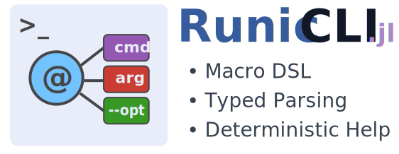

<p align="center">
  
</p>

# RunicCLI.jl

A macro-based, strongly-typed CLI definition framework for Julia, inspired by [ArgMacros.jl](https://github.com/zachmatson/ArgMacros.jl), extended with subcommands, mutual exclusion groups, multi-value options, structured help rendering, and exception-based control flow.

---

## Installation

<p>
RunicCLI is a &nbsp;
    <a href="https://julialang.org">
        
        Julia Language
    </a>
    &nbsp; package. To install RunicCLI,
    please <a href="https://docs.julialang.org/en/v1/manual/getting-started/">open
    Julia's interactive session (known as REPL)</a> and press <kbd>]</kbd>
    key in the REPL to use the package mode, then type the following command
</p>

```julia
pkg> add https://github.com/songtaogui/RunicCLI.jl
```

!!! Todo
    Register the package and install by `add RunicCLI`

---

## Why RunicCLI.jl

Existing Julia CLI libraries are powerful, but each optimizes for a different axis (speed of generation, classic parser model, or usage-text grammar).  
**RunicCLI.jl** focuses on a specific gap: a **macro-native, constraint-driven, auditable CLI layer** where command shape, validation rules, and help rendering are explicit and composable.

In practice, this means:

- clearer contracts at definition time (not only at runtime),
- predictable behavior for subcommands and argument groups,
- first-class handling of mutually exclusive options and validator chains,
- and help output that is both structured and themeable for product-grade UX.

If your CLI is growing from a script into an interface surface (for users, teams, or downstream embedding), RunicCLI is built for that transition.

## Feature comparison
> Notes for fairness: feature availability may vary by version and usage style.  
> This table is intended as a practical baseline for evaluation.

| Capability | RunicCLI.jl | ArgMacros.jl | ArgParse.jl | Comonicon.jl | DocOpt.jl |
|---|:---|:---|:---|:---|:---|
| Macro DSL declaration | ✅ | ✅ | ⚠️ (`@add_arg_table!` style) | ✅ | ❌ (usage-text driven) |
| Typed option/positional parsing | ✅ | ✅ | ✅ | ✅ | ⚠️ (mostly string/bool oriented) |
| Required/default/optional options | ✅ | ✅ | ✅ | ✅ | ✅ (via usage pattern semantics) |
| Flag and count options | ✅ (`@ARG_FLAG`, `@ARG_COUNT`) | ✅ | ✅ | ✅ | ⚠️ (pattern-level) |
| Positional modes (req/def/opt/rest) | ✅ | ✅ | ✅ | ✅ | ⚠️ (pattern-level) |
| Subcommands | ✅ (main + per-subcommand config) | ❌ | ✅ | ✅ (strong) | ✅ |
| Multi-value options | ✅ (`@ARG_MULTI`) | ❌ | ✅ | ✅ | ✅ (pattern repetition) |
| Mutual exclusion groups | ✅ (`@GROUP_EXCL`) | ❌ | ⚠️ (typically manual) | ⚠️ (typically manual) | ⚠️ (expressible in usage, less typed) |
| Argument validators | ✅ (`@ARG_TEST`, `@ARG_STREAM`) | ✅ | ✅ | ✅ | ⚠️ (usually post-parse) |
| Extra args control | ✅ (main + subcommand) | ✅ | ✅ | ✅ | ✅ |
| Help theming/template system | ✅ (structured template API) | ❌ | ⚠️ (customizable, less templated) | ⚠️ (doc/help oriented) | ❌ |
| Colored help support | ✅ | ❌ | ⚠️ | ⚠️ | ❌ |
| Exception-first control flow | ✅ (`ArgParseError`, `ArgHelpRequested`) | ⚠️ | ⚠️ | ⚠️ | ⚠️ |
| Duplicate flag/name compile-time checks | ✅ (strong in macro compiler) | ⚠️ | ✅ (runtime checks) | ✅ | ⚠️ |
| Docstring/function-to-CLI generation | ❌ | ❌ | ❌ | ✅ (major strength) | ✅ (usage-doc centric) |
| Shell completion generation | ✅ | ❌ | ⚠️ | ✅ | ❌ |


---

## Core concepts

- **`@CMD_MAIN TypeName begin ... end`**  
  Defines your CLI schema and generates the parser-backed type.

- **`parse_cli(Type, argv=ARGS)`**  
  Parses argv and returns a typed object.

- **Exceptions**
  - `ArgHelpRequested`: raised when `-h/--help` is requested.
  - `ArgParseError`: raised for parsing/validation errors.

---

## Quick start

```julia
using RunicCLI

@CMD_MAIN MyCLI begin
    @CMD_USAGE "mycli [OPTIONS] <input> [SUBCOMMAND]"
    @CMD_DESC "Example CLI built with RunicCLI"
    @CMD_EPILOG "Use `mycli <subcommand> --help` for subcommand details."

    @ARG_REQ Int threads "-t" "--threads" help="Number of worker threads", help_name="N"
    @ARG_OPT String log_level "--log-level" help="Log level" default="info"
    @ARG_FLAG verbose "-v" "--verbose" help="Enable verbose output"
    @ARG_COUNT quiet "-q" help="Decrease verbosity (repeatable)"
    @ARG_MULTI String include "-I" "--include" help="Include path", help_name="PATH"

    @POS_REQ String input help="Input file"
    @POS_OPT String output help="Optional output file"

    @GROUP_EXCL verbose quiet
    @ARG_TEST threads x -> x > 0 "threads must be > 0"

    @CMD_SUB "build" "Build artifacts" begin
        @CMD_USAGE "mycli build [OPTIONS] [TARGET...]"
        @ARG_FLAG release "-r" "--release" help="Build in release mode"
        @POS_REST String targets help="Build targets"
    end
end

function main(argv=ARGS)
    try
        cli = parse_cli(MyCLI, argv)

        if isnothing(cli.subcommand)
            @show cli.threads cli.log_level cli.input cli.output cli.include
            return
        end

        if cli.subcommand == "build"
            sub = cli.subcommand_args
            @show sub.release sub.targets
        end

    catch e
        if e isa ArgHelpRequested
            print(e.message)
            return
        elseif e isa ArgParseError
            println(stderr, e.message)
            return
        else
            rethrow()
        end
    end
end
```


## USAGE

### 1. Core workflow

1. Define a command schema with `@CMD_MAIN TypeName begin ... end`.
2. Inside the block, declare:
   - command metadata (`@CMD_USAGE`, `@CMD_DESC`, `@CMD_EPILOG`)
   - options (`@ARG_*`)
   - positionals (`@POS_*`)
   - validators (`@ARG_TEST`, `@ARG_STREAM`)
   - exclusion constraints (`@GROUP_EXCL`)
   - subcommands (`@CMD_SUB`)
3. Parse with:
   - `parse_cli(TypeName, argv)` or
   - `TypeName(argv)` directly
4. Handle exceptions (`ArgHelpRequested`, `ArgParseError`) manually or through `run_cli(...)`.


### 2. What `@CMD_MAIN` generates

```julia
@CMD_MAIN MyCLI begin
    ...
end
```

Generates:

- A concrete `struct MyCLI` with your declared fields **plus**:
  - `subcommand::Union{Nothing,String}`
  - `subcommand_args::Union{Nothing,NamedTuple}`
- A constructor:
  - `MyCLI(argv::Vector{String}=ARGS; allow_empty_option_value=false)`
- Compatibility with:
  - `parse_cli(MyCLI, argv)`
  - `run_cli(...)` workflows

#### Important shape rule

When no subcommand is selected:

- `obj.subcommand === nothing`
- `obj.subcommand_args === nothing`

When a subcommand is selected:

- `obj.subcommand == "subname"`
- `obj.subcommand_args` is a `NamedTuple` containing subcommand fields.

---

### 3. Allowed syntax inside `@CMD_MAIN`

Only DSL macros are allowed in the block.  
Regular statements are rejected at macro expansion time.

#### Command-level metadata
- `@CMD_USAGE "..."` (once per scope)
- `@CMD_DESC "..."` (once per scope)
- `@CMD_EPILOG "..."` (once per scope)
- `@ALLOW_EXTRA` (at most once per scope)

#### Arguments and constraints
- Options: `@ARG_REQ`, `@ARG_OPT`, `@ARG_FLAG`, `@ARG_COUNT`, `@ARG_MULTI`
- Positionals: `@POS_REQ`, `@POS_OPT`, `@POS_REST`
- Validators: `@ARG_TEST`, `@ARG_STREAM`, 
- Mutual exclusion: `@GROUP_EXCL`, `@GROUP_INCL`, `@ARG_CONFLICTS`, `@ARG_REQUIRES`

#### Subcommands
- `@CMD_SUB "name" begin ... end`
- `@CMD_SUB "name" "description" begin ... end`

Subcommand body also accepts the same argument/validation/exclusion macros plus metadata and `@ALLOW_EXTRA`.

---

### 4. Macro reference (practical)

#### A. Option macros

> `@ARG_REQ T name flags... [help="..."] [help_name="..."]`
> 
Required single-value option.

- Field type: `T`
- Must appear exactly once in argv
- Missing => parse error
- Repeated => parse error

---

> `@ARG_OPT T default name flags... [help=...] [help_name=...] [env="..."] [default="..."]`
> 
Optional single-value option with env and default support.

Behavior:
- Produces a field of type `Union{T,Nothing}` when `default` is not provided.
- Produces a field of type `T` when `default` is provided.
- Value resolution order is:
  1. CLI option value, if the option is present
  2. Environment variable value from `env="..."`
  3. `default=...`
  4. `nothing` (only when no default is provided)
- CLI input and environment input are parsed as `T`.
- `default` is converted to `T` using RunicCLI default conversion.
- Multiple occurrences of the same logical option are rejected.

Constraints:
- `name` must be a symbol identifier.
- At least one flag is required.
- Flags must be string literals and valid option tokens.
- Supported keywords are `help`, `help_name`, `env`, and `default`.
- `help`, `help_name`, and `env` must be string literals if provided.
- `help_name` must be non-empty and single-line.
- `env` must be non-empty.
- Not callable at runtime (placeholder macro outside DSL expansion).

---

> `@ARG_FLAG name flags... [help=...] [help_name=...]`
> 
Boolean switch.

- Field type: `Bool`
- `true` if present at least once
- Repetition allowed (still boolean)

---

> `@ARG_COUNT name flags... [help=...] [help_name=...]`
> 
Counter flag.

- Field type: `Int`
- Counts all occurrences across all aliases

---

> `@ARG_MULTI T name flags... [help=...] [help_name=...]`
> 
Repeatable value option.

- Field type: `Vector{T}`
- Each occurrence consumes one value
- Omitted => empty vector

---

##### Option flag rules (strict)

- At least one flag is required
- Flag must be string literal
- No whitespace in flag
- Must start with `-` (and not plain `-` or `--` as a usable flag)
- Short flag must be exactly one character after `-` (e.g. `-p`)
- Flags must be unique in the same command scope (no alias reuse across option-style args)

---

#### B. Positional macros

> `@POS_REQ T name [help=...] [help_name=...]`
> 
Required positional.

- Field type: `T`
- Missing => parse error


> `@POS_OPT T name [help=...] [help_name=...] [env="..."] [default=...]`
Optional positional.

Behavior:
- Produces a field of type `Union{T,Nothing}` when `default` is not provided.
- Produces a field of type `T` when `default` is provided.
- Value resolution order is:
  1. Next positional token, if available
  2. Environment variable value from `env="..."`
  3. `default=...`
  4. `nothing` (only when no default is provided)
- CLI input and environment input are parsed as `T`.
- `default` is converted to `T` using RunicCLI default conversion.

Constraints:
- `name` must be a symbol identifier.
- Only keyword metadata is allowed (`help`, `help_name`, `env`, `default`).
- `help`, `help_name`, and `env` must be string literals if provided.
- `help_name` must be non-empty and single-line.
- `env` must be non-empty.
- Must appear before `@POS_REST` (if any).
- Not callable at runtime (placeholder macro outside DSL expansion).


> `@POS_REST T name [help=...] [help_name=...]`
Variadic tail positional.

- Field type: `Vector{T}`
- Consumes all remaining positional tokens
- Only one allowed; must be last positional declaration

---

#### C. Validation / constraints

> `@ARG_TEST name fn [msg]`
Post-parse validator for one value.

- Skips `nothing`
- Fails if `fn(value)` is false

> `@ARG_STREAM name fn [msg]`
Element-wise validator for vectors; scalar fallback otherwise.

- Vector: all elements must pass
- Scalar: behaves like `@ARG_TEST`
- Error message includes failed values

> `@GROUP_EXCL a b c ...`
Mutual exclusion based on **explicit presence**.

- At most one may be provided
- Works only with option-style args (`@ARG_*`), not positionals
- Names must already be declared
- At least two names required

> `@ALLOW_EXTRA`
Allow leftover/unconsumed args in current scope.

- Without this: leftover tokens => parse error
- Can be set independently in main and each subcommand scope

---

#### D. Subcommands

> `@CMD_SUB "name" begin ... end`
> `@CMD_SUB "name" "description" begin ... end`

Rules:

- Name must be string literal, and must not start with `-`
- Name must be unique in same `@CMD_MAIN`
- Body must be `begin...end` DSL macros only
- Supports own metadata, args, validators, exclusions, and `@ALLOW_EXTRA`

Runtime routing:

- Main options/positionals are parsed from tokens before subcommand
- Subcommand tokens are parsed with subcommand schema
- Subcommand result stored in `subcommand_args::NamedTuple`

---

### 5. Type mapping summary

- `@ARG_REQ T`, `@ARG_DEF T`, `@POS_REQ T`, `@POS_DEF T` → `T`
- `@ARG_OPT T`, `@POS_OPT T` → `Union{T,Nothing}`
- `@ARG_FLAG` → `Bool`
- `@ARG_COUNT` → `Int`
- `@ARG_MULTI T`, `@POS_REST T` → `Vector{T}`

Plus always:

- `subcommand::Union{Nothing,String}`
- `subcommand_args::Union{Nothing,NamedTuple}`

---

### 6. Parsing APIs

> `parse_cli(::Type{T}, args=ARGS; allow_empty_option_value=false)`

Recommended entry point:

```julia
opts = parse_cli(MyCLI, ["--port", "9000", "input.txt"])
```

Equivalent to calling generated constructor:

```julia
opts = MyCLI(["--port", "9000", "input.txt"])
```

> `allow_empty_option_value`
> 
If `false` (default), option values like `--name ""` (empty token) are rejected.  
If `true`, empty string values are accepted.

---

### 7. `run_cli` integration pattern

Typical usage:

```julia
code = run_cli() do
    opts = parse_cli(MyCLI)
    # business logic
    return 0
end
```

Common behavior pattern in CLI apps:

- `ArgHelpRequested` -> print help text, exit success
- `ArgParseError` -> print error, non-zero exit

(If you need custom behavior, you can manually `try/catch` these exceptions.)

---

### 8. Help behavior details

- `-h` / `--help` before `--` triggers help exception (`ArgHelpRequested`)
- Main help includes subcommand list
- `cmd sub --help` triggers subcommand-specific help
- If `@CMD_USAGE` is omitted, usage is auto-derived
- `help="..."` and `help_name="..."` feed help rendering metadata

---

### 9. Tokenization and edge cases

- Supports `--opt=value` form (split into flag + value)
- Supports short bundles like `-abc` for letter flags
- `--` stops option parsing
- Negative numeric values are recognized as values (not option names) in value contexts
- For ambiguous positional negatives, recommend `--` separator explicitly

---

### 10. Complete example

```julia
@CMD_MAIN AppCLI begin
    @CMD_USAGE "app [OPTIONS] [SUBCOMMAND] [ARGS...]"
    @CMD_DESC "Example CLI"
    @CMD_EPILOG "Use -- before positional values starting with '-'"

    @ARG_FLAG verbose "-v" "--verbose" help="Verbose mode"
    @ARG_DEF Int 8080 port "-p" "--port" help="Port" help_name="PORT"
    @ARG_OPT String config "--config" help="Config path"
    @ARG_MULTI String tag "-t" "--tag" help="Repeatable tags"
    @ARG_COUNT quiet "-q" "--quiet" help="Decrease output"

    @POS_REQ String input help="Input file"
    @POS_OPT String mode help="Optional mode"
    @POS_REST String extras help="Extra positional args"

    @ARG_TEST port x -> x > 0 "port must be positive"
    @ARG_STREAM tag x -> !isempty(x) "tags must be non-empty"
    @GROUP_EXCL verbose quiet

    @CMD_SUB "serve" "Run server" begin
        @ARG_REQ String host "--host" help="Bind host"
        @ARG_FLAG daemon "-d" "--daemon" help="Run in background"
    end
end

opts = parse_cli(AppCLI, ["--port", "9000", "in.txt", "serve", "--host", "127.0.0.1"])
```

If subcommand `serve` is selected:

- `opts.subcommand == "serve"`
- `opts.subcommand_args` contains `(host = "127.0.0.1", daemon = false)` (depending on argv)

---

## Help Template Guide (`help.jl`)

This guide explains how to customize help rendering in `RunicCLI` using:

- `HelpStyle` (`HELP_PLAIN`, `HELP_COLORED`)
- `HelpTheme`
- `HelpFormatOptions`
- `build_help_template(...)`
- `render_help(def; template=..., path=...)`

---

### 1. Core Concepts

#### 1.1 `CliDef` is the source model for help
Help text is rendered from a `CliDef` structure (`cmd_name`, `usage`, `description`, `epilog`, `args`, and `subcommands`).

#### 1.2 `ArgHelpTemplate` is a section-based rendering pipeline
A template contains callable sections:

- `header`
- `section_usage`
- `section_description`
- `section_positionals`
- `section_options`
- `section_subcommands`
- `section_epilog`

Each section receives `(io, def, path)`.

#### 1.3 Template builder
Use `build_help_template(...)` to quickly create a template with style/theme/format controls.

---

### 2. Quick Start

```julia
using RunicCLI

tpl = default_help_template()  # plain style
# or:
# tpl = colored_help_template()

def = CliDef(
    cmd_name = "demo",
    usage = "demo [OPTIONS] [SUBCOMMAND]",
    description = "Example command for help rendering.",
    epilog = "See 'demo <subcommand> --help' for details.",
    args = ArgDef[
        ArgDef(kind=AK_OPTION, name=:threads, T=Int, flags=["-t","--threads"], required=true, help="Worker threads"),
        ArgDef(kind=AK_OPTION, name=:ratio, T=Float64, flags=["--ratio"], default=0.5, help="Ratio in [0,1]"),
        ArgDef(kind=AK_FLAG,   name=:dry_run, T=Bool, flags=["-d","--dry-run"], help="Do not execute writes"),
        ArgDef(kind=AK_POS_REQUIRED, name=:input, T=String, required=true, help="Input path")
    ],
    subcommands = SubcommandDef[
        SubcommandDef(name="run", description="Run a task"),
        SubcommandDef(name="inspect", description="Inspect artifacts")
    ]
)

println(render_help(def; template=tpl, path="demo"))
```

---

### 3. Styling with `HelpStyle` and `HelpTheme`

`HelpStyle` controls whether ANSI colors are emitted:

- `HELP_PLAIN` => no color
- `HELP_COLORED` => colored titles/items/meta

`HelpTheme` customizes color tokens:

```julia
theme = HelpTheme(
    reset = "\e[0m",
    usage_title = "\e[1;35m",
    section_title = "\e[1;34m",
    item_name = "\e[1;32m",
    meta = "\e[2;37m"
)

tpl = build_help_template(
    style = HELP_COLORED,
    theme = theme
)
```

---

### 4. Layout and metadata with `HelpFormatOptions`

`HelpFormatOptions` controls structure, labels, visibility, wrapping, and formatters.

#### Common fields

- `indent_item`, `indent_text`
- `title_usage`, `title_positionals`, `title_options`, `title_subcommands`
- `show_type`, `show_required`, `show_default`, `show_count_origin`
- `show_option_metavar`, `metavar_brackets`
- `wrap_description`, `wrap_epilog`, `wrap_width`
- `type_formatter`, `default_formatter`

Example:

```julia
fmt = HelpFormatOptions(
    indent_item = 4,
    indent_text = 8,
    title_usage = "USAGE:",
    title_positionals = "ARGS:",
    title_options = "OPTIONS:",
    title_subcommands = "COMMANDS:",
    show_type = true,
    show_required = true,
    show_default = true,
    show_option_metavar = true,
    wrap_description = true,
    wrap_epilog = true,
    wrap_width = 88,
    type_formatter = T -> string(T),
    default_formatter = x -> repr(x)
)

tpl = build_help_template(
    style = HELP_PLAIN,
    format = fmt
)
```

---

### 5. Overriding template fields directly

`build_help_template(...)` can override selected fields without rebuilding all `HelpFormatOptions`:

```julia
tpl = build_help_template(
    style = HELP_PLAIN,
    title_usage = "Usage:",
    title_options = "Flags and Options:",
    show_default = false,
    wrap_description = true,
    wrap_width = 100
)
```

---

### 6. Full example: custom formatting profile

```julia
using RunicCLI

def = CliDef(
    cmd_name = "pack",
    usage = "",
    description = "Package files into an archive with configurable behavior and output mode.",
    epilog = "Examples:\n  pack -f zip src/\n  pack -f tar --level 9 src/",
    args = ArgDef[
        ArgDef(kind=AK_OPTION, name=:format, T=String, flags=["-f","--format"], required=true, help="Archive format"),
        ArgDef(kind=AK_OPTION, name=:level, T=Int, flags=["-l","--level"], default=6, help="Compression level"),
        ArgDef(kind=AK_OPTION_MULTI, name=:file, T=String, flags=["--file"], help="Input file (repeatable)"),
        ArgDef(kind=AK_COUNT, name=:verbose, T=Int, flags=["-v"], help="Increase verbosity"),
        ArgDef(kind=AK_POS_REQUIRED, name=:target, T=String, required=true, help="Target folder")
    ],
    subcommands = SubcommandDef[]
)

fmt = HelpFormatOptions(
    show_type = true,
    show_default = true,
    show_required = true,
    show_count_origin = true,
    wrap_description = true,
    wrap_epilog = true,
    wrap_width = 72
)

tpl = build_help_template(style=HELP_PLAIN, format=fmt)

println(render_help(def; template=tpl, path="pack"))
```

If `usage` is empty, the renderer automatically builds a fallback usage line from command shape.

---

### 7. Rendering flow details

`render_help` executes template sections in this order:

1. `header`
2. `section_usage`
3. `section_description`
4. `section_positionals`
5. `section_options`
6. `section_subcommands`
7. `section_epilog`

Each section may emit text or return nothing. Empty sections are skipped.

This means you can implement highly customized templates by replacing one or more section functions.

---

### 8. Minimal fully-custom template example

```julia
using RunicCLI

tpl = ArgHelpTemplate(
    header = (io, def, path) -> println(io, "== ", isempty(path) ? def.cmd_name : path, " =="),
    section_usage = (io, def, path) -> begin
        println(io, "USAGE: ", isempty(def.usage) ? "(auto)" : def.usage)
    end,
    section_description = (io, def, path) -> !isempty(def.description) && println(io, def.description),
    section_positionals = (io, def, path) -> nothing,
    section_options = (io, def, path) -> begin
        for a in def.args
            if a.kind in (AK_FLAG, AK_COUNT, AK_OPTION, AK_OPTION_MULTI)
                println(io, " - ", join(a.flags, ", "), " => ", a.name)
            end
        end
    end,
    section_subcommands = (io, def, path) -> begin
        if !isempty(def.subcommands)
            println(io, "SUBCOMMANDS:")
            for s in def.subcommands
                println(io, " * ", s.name, " - ", s.description)
            end
        end
    end,
    section_epilog = (io, def, path) -> !isempty(def.epilog) && println(io, def.epilog)
)
```

---

### 9. Best practices

1. Keep `usage` explicit for public CLIs.
2. Enable wrapping (`wrap_description`, `wrap_epilog`) for long docs.
3. Use `type_formatter` and `default_formatter` to normalize output style.
4. Use `HELP_PLAIN` in CI snapshots and `HELP_COLORED` for interactive UX.
5. Keep subcommand descriptions concise for aligned listing readability.
```

